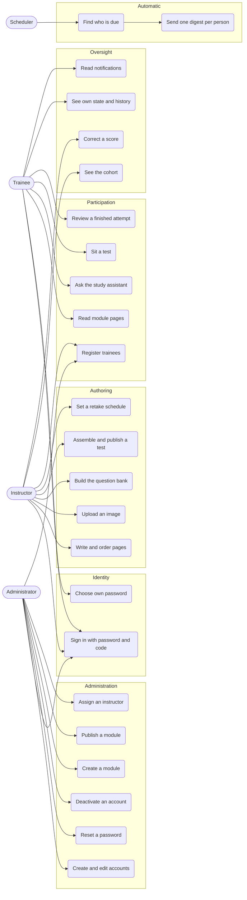
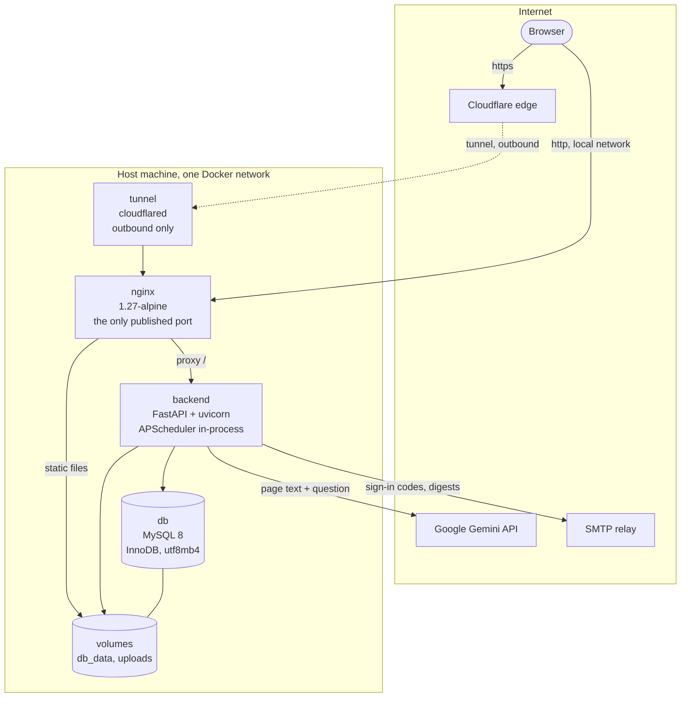
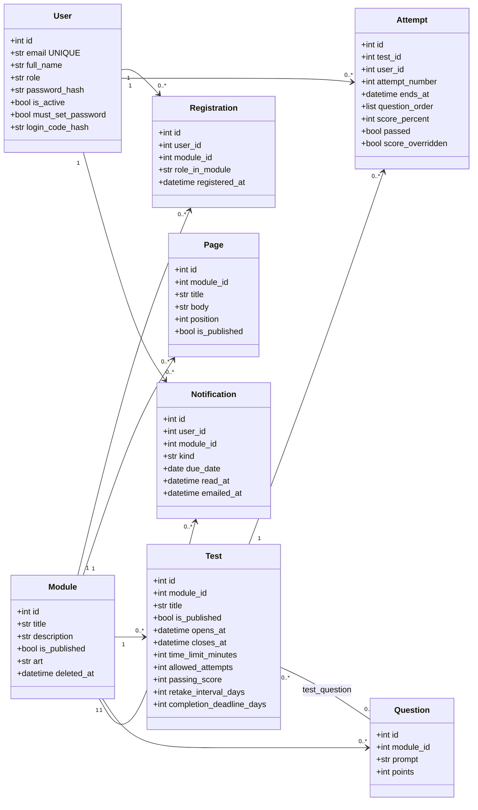
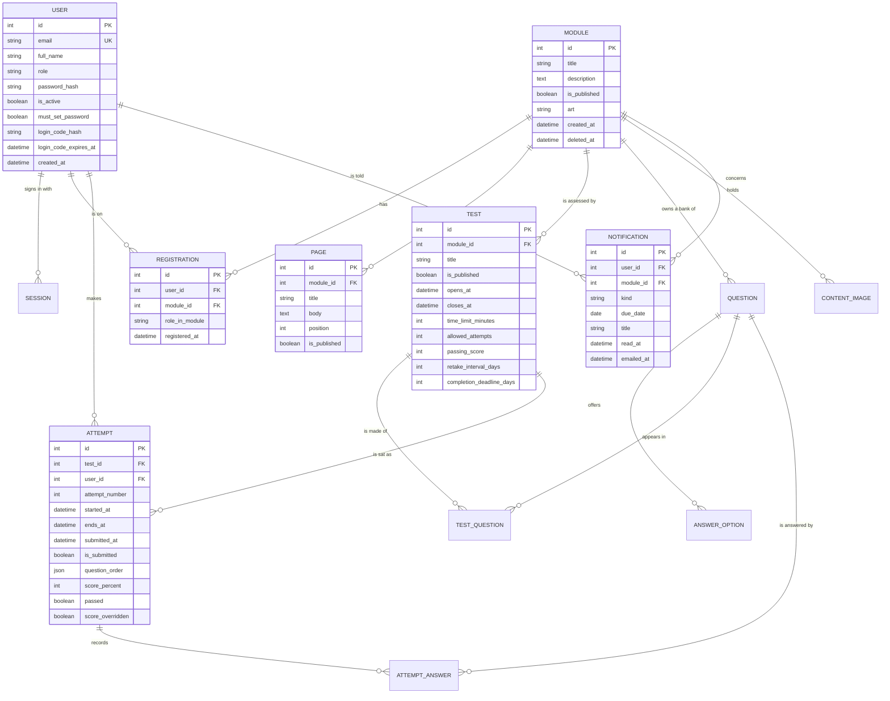
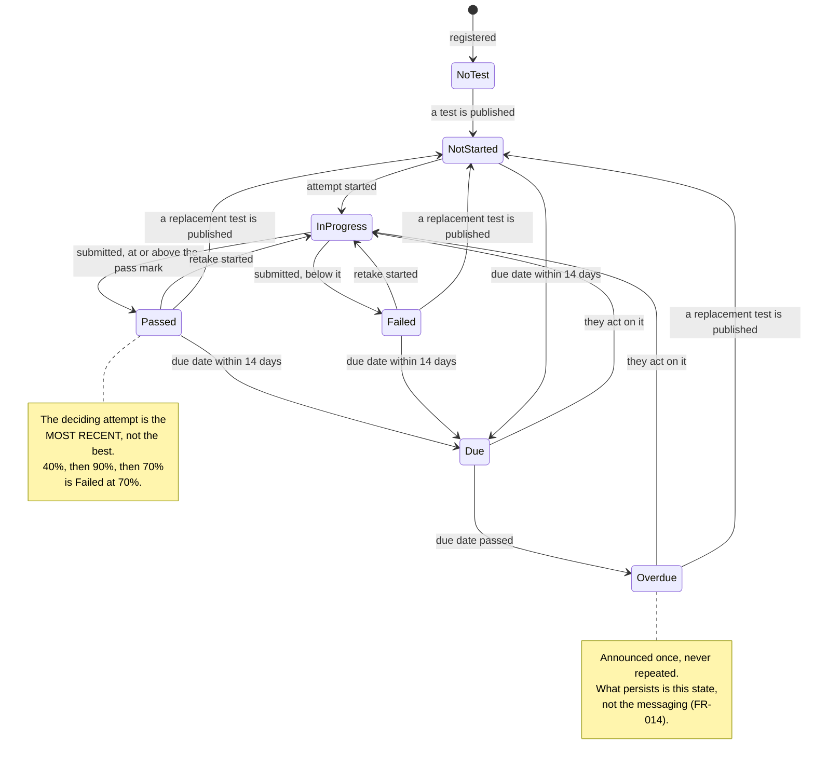
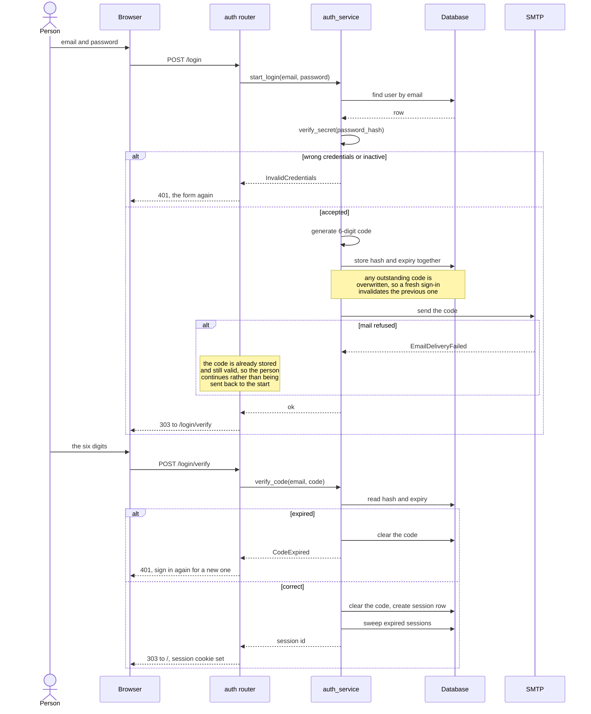
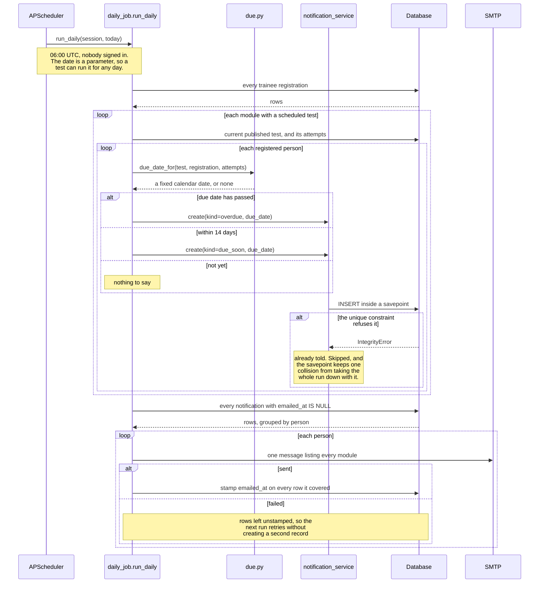
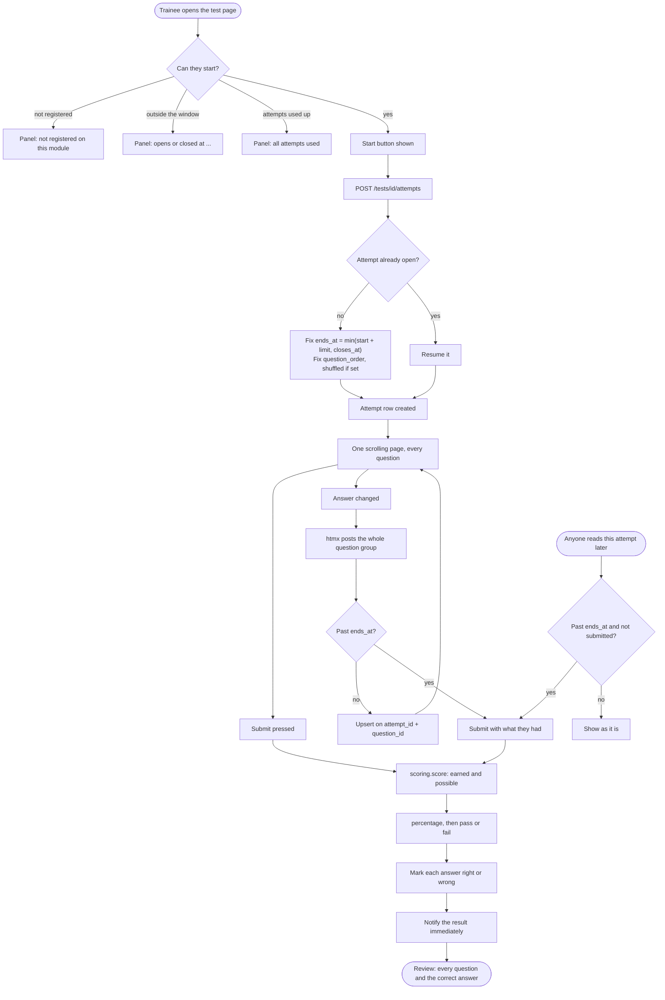
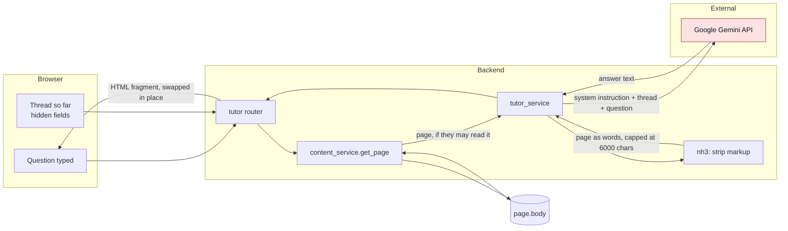

# System Analysis and Design

**SME Cybersecurity Awareness Training Platform**

| | |
|---|---|
| Course | COMP6900 Major Project, University of Newcastle |
| Group | 5 |
| Document | System analysis and design |
| Date | 15 September 2026 |
| System under description | 13 tables, 65 routes, 177 functional requirements, 635 automated tests |

---

## Contents

1. [Introduction and scope](#1-introduction-and-scope)
2. [Requirements analysis](#2-requirements-analysis)
3. [System architecture](#3-system-architecture)
4. [Data design](#4-data-design)
5. [Process design](#5-process-design)
6. [Interface design](#6-interface-design)
7. [Verification](#7-verification)
8. [Evaluation and limitations](#8-evaluation-and-limitations)

---

## 1. Introduction and scope

### 1.1 The problem

Small and medium enterprises are obliged to train staff in cybersecurity
awareness and are the least equipped to do it. Commercial platforms are priced
and shaped for organisations with a compliance department. The common substitute
is a slide deck emailed round once a year, which records nothing, proves nothing,
and lapses silently.

Three things are actually needed, and only the third is difficult:

1. Somewhere to put the material.
2. A way to check that it was understood.
3. **A record of who is current and who is not, that stays true without anybody
   maintaining it.**

### 1.2 What the system does

An administrator creates accounts and modules and assigns instructors. An
instructor writes the module's pages and builds a test from a bank of questions.
A trainee reads the pages in order, sits the test at the end, and sees where they
stand. From then on the platform works out who is due, tells them before their
training lapses and once it has, and keeps doing so with nobody signed in.

### 1.3 Scope boundaries

The project defends its non-goals as firmly as its goals, because an awareness
platform that drifts into being a general learning management system is a project
that never finishes. Excluded by decision, not by omission:

| Excluded | Reason |
|---|---|
| Self-registration of any kind | Training is assigned, not chosen. An administrator creates accounts; an administrator or the module's instructor puts people on modules |
| Assignment submission and marking | The assessment here is an automatically scored test, not coursework |
| Discussion forums, messaging, calendars | Not what an awareness platform is for |
| SCORM or xAPI import | The content is authored in the platform |
| Notification preferences and unsubscribe | Mandatory training is not opt-out |
| Multiple organisations in one instance | One deployment serves one SME |
| Certificates, badges, gamification | A pass is a record, not a prize |

### 1.4 Delivery method

The system was specified before it was built, using a specification-first
workflow: a written constitution of eight principles, then five phase
specifications, each carrying its own functional requirements, implementation
plan, data model, route contracts and task breakdown. Every phase ends with
running software.

| Phase | Delivers | FRs |
|---|---|---|
| 0 Foundation | Identity, two-step sign-in, sessions, roles, the application shell | 36 |
| 1 Modules and content | Modules, ordered pages, rich text, images, registration | 35 |
| 2 Tests | Question bank, tests, attempts, automatic scoring | 39 |
| 3 Results | Derived state, dashboards, cohort views | 27 |
| 4 Scheduling | Retake intervals, the daily sweep, notifications | 40 |
| | **Total** | **177** |

---

## 2. Requirements analysis

### 2.1 Actors

The platform has three platform-wide roles, and one distinction that is
frequently missed and matters throughout the design.

| Actor | Description |
|---|---|
| **Administrator** | Owns the platform. The only actor who creates accounts, creates and publishes modules, and assigns instructors |
| **Instructor** | Authors and runs the modules they are assigned to. Sees no module they are not assigned to, published or otherwise |
| **Trainee** | Reads material and sits tests. Cannot put themselves on anything |
| **Scheduler** | Not a person. The daily process that finds who is due and notifies them, running with nobody signed in |

**The distinction.** A platform role is not a capacity on a module.
`registration.role_in_module` is independent of `user.role`, so the same person
may instruct one module and train on another (FR-026, Phase 1). Authorisation
asks the registration, never the platform role. This is why the roster form asks
"register them as" before it asks "who".

### 2.2 Use case diagram

**Reading the diagram.** Every actor passes through UC1: there is no route into
the platform that does not require a password and a six-digit code. UC2 appears
only for the trainee because an administrator-created account cannot reach any
other page until its owner has chosen a password of their own, and administrators
and instructors reach that state by the same path.

### 2.3 Functional requirements

177 requirements across five phases. Rather than restate them, this section names
the ones that shaped the architecture, because those are the ones a reader needs
in order to understand why the system is built as it is.

**Identity and access.**

| Id | Requirement |
|---|---|
| FR-002 (P0) | No self-registration. Accounts are created by an administrator |
| FR-011 (P0) | An account whose password an administrator set reaches nothing until its owner chooses one |
| FR-018 (P0) | A fresh sign-in invalidates any outstanding code |
| FR-022 (P0) | Deactivation takes effect on that account's very next request, not at expiry |
| FR-026 (P1) | Capacity on a module is independent of the platform role |

**Content and assessment.**

| Id | Requirement |
|---|---|
| FR-018 (P1) | Authoring is restricted to instructors assigned to that module |
| FR-013 (P2) | A test that anybody has attempted is frozen: nothing in it may change |
| FR-016 (P2) | An instructor's later edit must not move the deadline of an attempt already running |
| FR-020 (P2) | The server owns the clock. The countdown a browser shows decides nothing |
| FR-022 (P2) | An expired attempt is submitted and scored the next time anyone reads it |

**State and scheduling.**

| Id | Requirement |
|---|---|
| FR-005 (P3) | The **most recent** attempt represents a person, not the best one |
| FR-008 (P3) | Attempts at a replaced test remain visible in history but decide nothing |
| FR-025 (P3) | State is derived at read time, never stored |
| FR-007 (P4) | Due dates are derived, so changing an interval re-dates everyone at once |
| FR-008 (P4) | Somebody who has never passed gets a full first cycle from their registration |
| FR-009 (P4) | The interval runs from the most recent attempt, and only if it passed |
| FR-014 (P4) | An overdue test is announced once. What persists is the state, not the messaging |
| FR-024 (P4) | Running the scheduled process twice for the same day produces no duplicate record and no second message |

### 2.4 Non-functional requirements

| Attribute | Requirement | How it is met |
|---|---|---|
| Deployability | One command on one machine | `docker compose up`, three containers |
| Portability | No managed cloud service | MySQL, nginx, a Python process. Verified on x86 Windows and arm64 macOS |
| Offline operation | No CDN, no external font | Bootstrap, htmx and Quill are vendored into the repository |
| Response time | Server-rendered pages in tens of milliseconds | No client framework, no build step |
| Accessibility | WCAG AA contrast | Measured, not asserted. Lowest measured pair 5.51:1 against a 4.5:1 requirement |
| Responsiveness | Usable at phone, tablet and desktop widths | One layout rule outranks the rest: nothing may push the page sideways |
| Correctness | Every user-facing behaviour covered | 655 automated tests against a real MySQL instance |
| Data integrity | Guarantees in the database, not in application code | Unique constraints on email, registration, answer and notification |

---

## 3. System architecture

### 3.1 Architectural style

A three-tier, server-rendered web application with a strictly layered
application tier. The layering is not conventional politeness; it is enforced by
the project constitution and checked mechanically by tests.

| Layer | Responsibility | Rule |
|---|---|---|
| **Routers** | Parse the request, call one service, render a template | May not contain a query. No module under `routers/` contains the token `Session` or `select`, and a test asserts it |
| **Services** | All business logic and all authorisation | Take plain arguments and return plain values. Know nothing of HTTP |
| **Models** | The schema itself | `SQLModel.metadata.create_all()` is the single schema authority. No migration tool |
| **Schemas** | Read and write models at every boundary | No `table=True` instance reaches a template or a response, and a test asserts it by rendering every page and inspecting the context |

**Why authorisation lives in the service layer.** A guard on a route protects
that route. A guard in the service protects every caller, including the daily
job, a future command line tool, and the route somebody adds next year and
forgets to decorate. Every module-scoped service function performs its own check;
the router guard is a second line, never the enforcement.

The consequence appears throughout: the platform answers **404 rather than 403**
for a module somebody may not see, because the existence of a module they cannot
reach is itself information they have no claim to.

### 3.2 Deployment

**Three containers, one published port.** Only nginx publishes a port. The
application and the database are reachable only from inside the compose network.
The tunnel is a fourth container and is deliberately not part of the platform:
the three tiers run identically without it, which is how the system runs on a
local network.

**The tunnel is outbound only.** cloudflared opens a connection to Cloudflare
and serves through it, so the host needs no public address, no forwarded port
and no certificate of its own. The hop from the connector to nginx is plain HTTP
inside the Docker network and never leaves the machine.

**One constraint governs that arrangement, and breaking it is invisible.** Every
connector registered on a tunnel must be able to reach every origin that tunnel
serves, because Cloudflare distributes requests across all of them and does not
fail over. A second connector that cannot reach nginx answers 502 for whatever
share of requests reaches it, and those requests leave no trace in this
platform's logs because they never arrive. The failure then appears to follow
the client's network rather than the server, which is what made it hard to place
(§7.3).

**The scheduler runs in-process.** The constitution permits scheduled work inside
the backend and forbids a broker, a worker container or a separate cron
container. APScheduler starts in the application lifespan and stops with it. This
assumes exactly one backend instance; two would run two schedulers, which the
design survives because the daily job is idempotent, but it is a single-instance
platform by intent.

### 3.3 Class diagram

### 3.4 Service layer

Sixteen services. Four are pure functions with no database access at all, which
is the design's most deliberate structural choice: the rules that are easiest to
get subtly wrong are the ones isolated where they can be tested exhaustively
against a table of cases.

| Service | Pure | Responsibility |
|---|---|---|
| `scoring` | **yes** | Points earned, percentage, pass or fail |
| `state` | **yes** | Which of seven states a person is in on a module |
| `due` | **yes** | When somebody's training next falls due |
| `art` | **yes** | Which colour a module's cover carries, and whether a picture was uploaded for it |
| `auth_service` | | Password, code issue and verification, sessions |
| `admin_service` | | Accounts. Nobody administers their own |
| `module_service` | | Modules, and the `get_for` / `get_for_write` chokepoint |
| `content_service` | | Pages, ordering, image storage |
| `question_service` | | The question bank |
| `test_service` | | Building a test, and the freeze once attempted |
| `attempt_service` | | Taking, saving, submitting and reviewing |
| `registration_service` | | Putting people on modules and taking them off |
| `results_service` | | Everything derived. Nothing here writes |
| `notification_service` | | Records first, messages second |
| `daily_job` | | The scheduled sweep, as one ordinary function |
| `tutor_service` | | The study assistant |

**The chokepoint.** Every read of a module passes through `module_service.get_for`
or `get_for_write`. Neither ever answers "found but forbidden" for a module the
caller may not see, so the distinction between "does not exist" and "exists but
is not yours" is never leaked by a status code.

---

## 4. Data design

### 4.1 Entity relationship diagram

### 4.2 Table inventory

Thirteen tables. Five carry a unique constraint, and each of those constraints
is load-bearing: it makes a guarantee true in the database rather than in
application code that somebody could forget to call.

| Table | Columns | Unique constraint | What the constraint guarantees |
|---|---|---|---|
| `user` | 10 | `email` | One account per address |
| `session` | 4 | | |
| `module` | 7 | | |
| `registration` | 5 | `(user_id, module_id)` | Nobody is on a module twice |
| `page` | 8 | `(module_id, position)` | Page order is unambiguous |
| `content_image` | 4 | | |
| `question` | 6 | | |
| `answer_option` | 5 | | |
| `test` | 14 | | |
| `test_question` | 3 | composite PK | A question appears once per test |
| `attempt` | 14 | | |
| `attempt_answer` | 6 | `(attempt_id, question_id)` | One answer per question, however many times they change their mind |
| `notification` | 10 | `(user_id, kind, module_id, due_date)` | **The daily job is safe to run twice** |

### 4.3 What is deliberately not stored

The most consequential data decisions in this system are absences. Each removes
an entire class of defect rather than mitigating it.

| Not stored | Derived from | Defect it removes |
|---|---|---|
| A person's state on a module | Registration, current test, their attempts | A cached state that disagrees with the attempts it came from |
| A due date | The test's interval and the deciding attempt | A backfill whenever an instructor changes an interval (FR-007) |
| "Test is frozen" | Whether any attempt row exists | A flag that says unfrozen while attempts exist |
| "Last run" for the scheduler | Nothing. The job is a full sweep | A stored timestamp that is wrong after a restart, a clock change, or a half-completed run |
| A results or summary table | The attempts themselves | Two sources of truth for one number |

**The cost is accepted and named.** Deriving state means the dashboard runs
queries a stored column would not. At the scale this platform targets, tens of
people across tens of modules, that cost is invisible, and the correctness it
buys is permanent.

### 4.4 Schema management

There is no migration tool. `SQLModel.metadata.create_all()` runs at startup and
is the single schema authority. `create_all` creates a missing table but never
alters an existing one, so a new table appears on restart while a new **column**
requires the database to be recreated.

This is a time-limited principle, recorded as such in the constitution. It has
been departed from three times on the live deployment, each time by hand and
each time recorded, rather than by discarding real data:

| Change | Statement | Why it could not wait |
|---|---|---|
| `module.art` added | `ALTER TABLE module ADD COLUMN art VARCHAR(32) NULL` | The cover feature, on a database already carrying modules |
| `module.art` widened to 64 | `ALTER TABLE module MODIFY art VARCHAR(64) NULL` | A stored image name is a 32-character uuid plus an extension, which does not fit the width a colour name needed |
| Seven columns dropped | `ALTER TABLE ... DROP COLUMN` on `content_image`, `session` and `attempt_answer` | They were written on every operation and read by nothing (§4.5) |

In every case the model carries the change, so a database created fresh is
already correct, and the running instance was brought level by hand. The pattern
is the same each time: the model is the specification, and a live database is
reconciled to it deliberately rather than automatically.

### 4.5 Columns removed after audit

Schemas accumulate columns that were plausible when written and are read by
nothing once the system exists. An audit compared every column against the code
that reads it, distinguishing a column that is *written* from one that is
*read*: a value assigned on every operation and never consulted looks like
recorded data and is not.

Seven were removed, with the code that wrote them:

| Table | Column | Written | Read |
|---|---|---|---|
| `content_image` | `content_type` | Every upload | Nowhere |
| `content_image` | `size_bytes` | Every upload | Nowhere |
| `content_image` | `uploaded_by` | Every upload | Nowhere |
| `content_image` | `uploaded_at` | Every upload | Nowhere |
| `session` | `ip` | Every sign-in | Nowhere |
| `session` | `user_agent` | Every sign-in | Nowhere |
| `attempt_answer` | `answered_at` | Every answer change | Nowhere |

`content_image` fell from eight columns to four. `uploaded_by` was the only
foreign key in the schema that no query ever traversed, so its constraint was
dropped with it.

**Three were kept although unread**, because the distinction is between a column
nobody reads and a column nobody reads *yet*. `attempt.points_earned`,
`attempt.points_possible` and `attempt_answer.points_awarded` are the raw
numbers behind a percentage. Without them a score of 75% is a number that cannot
be explained or recomputed, and the information cannot be recovered later
because it was never kept. The `created_at` timestamps were kept on the same
reasoning.

The audit also found five definitions in the code that nothing referenced: two
service functions, an exception never raised, and two request models never
constructed. One of them, `most_recent_submitted`, carried a docstring claiming
two phases read it; in fact the rule it named had been rewritten three times
elsewhere, against a list rather than a query, once the services began loading
attempts in bulk. The function was removed. **The duplication it left behind is
recorded as outstanding in §8.2**, because that is a design question rather than
dead code.

---

## 5. Process design

### 5.1 The state machine

Every trainee is in exactly one of seven states on every module they are
registered on. The state is computed at read time by one pure function, which all
three views call. Any state computed inside a query, a template or a second
helper would be a copy of this rule, and copies drift.

**Two rules that the diagram encodes and prose tends to blur.**

*Most recent, not best.* Somebody who scored 40%, then 90%, then 70% is **failed
at 70%**. Training measures what a person knows today, not their best day. If the
rule quietly became "best attempt", the platform would report a workforce as
trained when it is not, and nothing would complain.

*A replacement resets the cohort.* State follows the module's **currently
published** test. Publishing a replacement makes everyone "not started" again,
because the module now asks something different. Their old attempts stay in
history marked as being at a replaced test. The instructor is told the count
before it happens: "Publish it and reset 12 people".

### 5.2 Sequence: two-step sign-in

**Why the code is stored hashed with its expiry in the same write.** A code and
its deadline that can be written separately can disagree. They are written
together, and cleared together on use, so a used code cannot be replayed and an
expired one is deleted on sight.

**The session is re-read on every request**, and `is_active` re-checked, which is
what makes deactivation take effect on the account's very next request rather
than whenever its session happened to expire (FR-022).

### 5.3 Sequence: the daily sweep

**Idempotency comes from the database, not from bookkeeping.** There is no
`last_run` record anywhere. A stored last-run timestamp is wrong after a restart,
wrong if the clock moves, and wrong if a run half-completed. Instead the job asks
who is due **now**, and the unique constraint on
`(user_id, kind, module_id, due_date)` refuses a second insert. Run it twice for
the same date and the second run creates nothing and sends nothing, which a test
asserts directly.

**The due date must be a fixed calendar date.** If any branch of `due.py`
returned "now", the key an overdue row is written under would move every morning,
and a notification meant to arrive once would arrive daily. This is the single
defect the whole phase is shaped to prevent, and a test walks every branch to
confirm none of them reads a clock.

**One message, several records.** Somebody overdue on three modules receives one
email and sees three entries in their list. The record and the message are
different things: the record is the notification, the message is a delivery of
it, and the record always exists first.

### 5.4 Activity: taking a test

**Three design decisions are visible in this diagram.**

*`ends_at` and `question_order` are fixed once, at creation, and never
recomputed.* This is what makes an instructor's later edit harmless to an attempt
already running, and what makes an interrupted attempt resumable on another
device as the same attempt.

*Each answer is its own write.* An upsert the moment it is given, so a dropped
connection loses at most the click in flight rather than the whole attempt.

*There is no background sweep for expired attempts.* An attempt past its ending
moment is submitted and scored **the next time anyone reads it**, which is why
the diagram has a second entry point. The rule holds wherever a read happens: the
trainee's dashboard, the instructor's cohort view, or the attempt itself.

### 5.5 Data flow: the study assistant

**The external call is named rather than buried.** The page text and the
trainee's question leave the server and reach Google. That is what the feature
is, and it is the first thing a reviewer of this platform should be told.

**Nothing is stored.** No table, no column, no migration. The conversation lives
in hidden form fields in the reader's own browser and comes back with each
question, trimmed to the last six exchanges. Closing the page ends it.

**The page is fetched through the same service every other reader uses**, so the
assistant cannot become a route to read a module somebody is not on. A stranger
asking about a page receives 404, and a test asserts it.

**With no API key the feature does not exist**: no panel renders, no route
answers, and the platform behaves exactly as it did before the feature was
written.

---

## 6. Interface design

### 6.1 Approach

Server-rendered Jinja2 templates over vendored Bootstrap 5.3, with htmx for the
three places that genuinely need to update in place: saving a test answer, asking
the assistant, and reordering pages. There is no client framework and no build
step. Every asset is local, so the interface works on a machine with no outbound
access.

### 6.2 Design system

35 templates share one stylesheet built entirely from design tokens: a neutral
ramp, one brand hue, semantic colours, a 1.125 type scale from a 15.6px base, and
4px spacing. No template carries a colour, a radius or a spacing value of its
own.

Components reference **role** tokens rather than palette tokens, which is what
makes the dark theme a redefinition of one block rather than a second stylesheet.
The theme follows the operating system, applied before the stylesheets load so
the first paint is already correct.

### 6.3 Accessibility

| Requirement | Status |
|---|---|
| 4.5:1 contrast for normal text | **Measured** with WCAG relative luminance. Lowest pair 5.51:1 |
| 3:1 for graphical objects | Not claimed. The drawn covers this measured were removed; a cover is now a plain colour or an uploaded picture, and carries no information |
| Visible focus | One global `:focus-visible` rule, so no component can be missed |
| Touch targets | 44px minimum on buttons, inputs, navigation links and choice rows |
| Colour never alone | Every state badge carries its word: Passed, Failed, Due, Overdue, Not started, In progress, No test |
| Reduced motion | `prefers-reduced-motion` collapses every transition |
| Text scaling | Every size in rem; the desktop step is a root percentage, so a reader's own browser font preference is preserved rather than overruled |

**One exclusion is declared rather than quietly skipped.** Keyboard navigation
requirements were removed from this project at the owner's direction, so the
platform makes no claim to that part of WCAG AA. Focus styling is present because
it costs nothing, but it is styling rather than a claim.

### 6.4 Three interface decisions worth recording

**A control nobody may use is not a control.** The Start button appears only for
somebody who can actually start; where they cannot, a panel names the reason. The
administrator's own row is absent from the accounts list rather than present and
inert. Publishing is absent for an instructor rather than shown and refused. In
every case the service refuses it as well, so the page hiding a control is never
the enforcement.

**Empty is a statement, not a blank frame.** Every list has an empty branch that
says what the situation is, because somebody with nothing to do should be told
that rather than left wondering whether the page failed to load.

**One form, one Save.** The cover picture was first built as its own form with
its own upload button, sitting below the form that saves the module. It was
reported as broken twice in one message: there was no Save after uploading, and
a module being created could not be given a picture at all, because the file
needs a module to belong to and the record did not exist yet. Both followed from
the same mistake. A field that belongs to a record is saved with that record:
the picture moved into the module form, the separate routes were deleted, and
the file is now read before the module is created and stored once it exists.
Two save buttons on one page are two ways to half-save it.

---

## 7. Verification

### 7.1 Test strategy

**655 tests across 51 files**, run against a real MySQL 8 instance in a
disposable schema, never SQLite. The project depends on unique indexes, foreign
keys and `utf8mb4`, and SQLite enforces none of them the same way; a suite that
passed on SQLite would prove less than it appeared to.

Each test runs inside a transaction that is rolled back, so tests never see each
other's leftovers.

| Kind | What it covers |
|---|---|
| Pure function tests | `scoring`, `state`, `due`, `art` exhaustively, by table of cases |
| Service tests | Authorisation, freezing, idempotency, the daily job run twice |
| Router tests | Status codes, what each role may reach, CSRF, what a page offers |
| Structural tests | The done-gates, asserted mechanically rather than reviewed |

### 7.2 Done-gates as executable checks

Six gates govern every phase. Two of them are assertions rather than reviews:

- **No module under `routers/` imports `Session` or `select`.** A grep, run as a
  test.
- **No `table=True` instance reaches a template.** Every page is rendered and its
  context inspected recursively.

Running the second gate as a test is what found `current_test` handing a table
row to two templates, which reading the routers had not.

### 7.3 Defects found by verification

Several defects in this system were found by a test or by a live check rather
than by review, and they are recorded because the kind matters more than the
count.

| Defect | Found by | Why review missed it |
|---|---|---|
| `most_recent_submitted` returned the first attempt | A test asserting the rule | `submitted_at` has second precision; two attempts in one second ordered arbitrarily |
| Results pages never triggered expire-on-read | A test written for the requirement | Nothing looked wrong. A lapsed attempt simply sat as "in progress" forever |
| `GET /` registered twice | A structural test | A second registration is shadowed silently, with no error to find |
| The scheduled sweep died every night | Watching a real scheduled run | `main.py` had shadowed the session type with the session table. Every test called the job with a session already in hand |
| Page navigation never rendered | A test asserting the links | Comparing model objects rather than ids matched nothing, so every page silently became the last one |
| nginx would not start on macOS | Deploying to a second platform | Docker Desktop on Windows reported 755 for build-context files and hid a 644 script |
| Intermittent 502 from the public address | Comparing the two network paths a client can take | A second connector on the same tunnel could not reach nginx. Cloudflare spreads requests across every connector, so roughly half failed, and the failures left no trace in this platform's logs because those requests never arrived |
| Every save without a file attached was refused | A test that posted the form the way a browser does | An untouched file input still posts a part. Two clients shape it differently, and the route accepted only one of the two shapes |

---

## 8. Evaluation and limitations

### 8.1 Against the objectives

| Objective | Outcome |
|---|---|
| Deployable by an SME without specialist staff | One command, three containers, one configuration file |
| Material authored in the platform | Rich text with server-side sanitising, ordered pages, image upload |
| Assessment with a recorded outcome | Automatic scoring, attempt history, instructor correction |
| A record that stays true without maintenance | State and due dates derived at read time, never stored |
| Acts without being asked | A daily sweep that is safe to run twice, never, or late |

### 8.2 Known limitations

**Single instance by design.** The scheduler runs in-process, so two backend
replicas would run two schedulers. The unique constraint makes that wasted work
rather than duplicate email, but the platform is single-instance by intent and
does not horizontally scale.

**No migration path.** `create_all` never alters an existing table, so every
column change on a live database is a hand-written statement, applied in the
right order relative to the deploy or the two disagree. Three such changes have
now been made (§4.4). This is acceptable while the system is being built and is
not acceptable once it holds an organisation's training record.

**Derived state has a cost that will eventually be visible.** The dashboard runs
whole-set queries. At tens of people across tens of modules this is invisible.
At thousands it would not be, and the answer would be a cache with an explicit
invalidation rule rather than a stored column.

**Mail delivery is unresolved.** SMTP is implemented and correct, but the
provider used during development refuses to send. The sign-in code is printed to
the server console and shown on the verification page in development builds, both
removable by one setting.

**The assistant sends page content to a third party.** This is inherent to the
feature. An organisation with a policy against that should leave the API key
empty, at which point the feature does not exist.

**One rule is written in three places.** Which attempt represents a person, the
most recent rather than the best, with the row id breaking a tie because
`submitted_at` has only second precision, appears twice in `state` and once in
`due`. It was extracted into a single function once, but the services then
changed to load attempts in bulk and pass lists rather than query one at a time,
and the extraction was left behind unused instead of being rewritten to match.
Removing the unused function (§4.5) did not resolve the duplication. Changing
the rule today means finding three places, and the compiler will not help.

**A cover is decoration only.** It was once a drawn pattern chosen per module,
then a set of emblems, and is now a plain colour or an uploaded picture. Nothing
about a module's state, progress or urgency is expressed by it, and nothing
should be: the state badges carry that, in words.

### 8.3 Further work

1. A migration tool, before the platform holds a real training record.
2. A mail provider that will accept the traffic.
3. Extract the deciding-attempt rule into one place that `state` and `due` both
   call, on the list rather than on a query.
4. Per-question analytics for instructors: which question the cohort fails most.
5. An export of the training record, for an auditor who wants it outside the
   platform.

---

## Appendix A: Route inventory

65 routes across twelve routers, each owning one area. The counts below are
taken from the routers themselves and sum to the total, which an earlier
revision of this table did not.

| Area | Router | Routes | Notable |
|---|---|---|---|
| Identity | `auth`, `password` | 7 | Two-step sign-in, sign out, forced password change |
| Administration | `admin` | 7 | Accounts. None of them acts on the caller's own |
| Modules | `modules` | 11 | Create, publish, soft delete and restore, cover picture |
| Content | `content` | 10 | Pages, ordering, images |
| Registration | `registrations` | 3 | Roster, add, remove |
| Questions | `questions` | 6 | The module's bank |
| Tests | `tests` | 7 | Build, publish, and the confirmation before a replacement |
| Attempts | `attempts` | 7 | Start, answer, submit, review, correct |
| Results | `results` | 4 | Including `GET /`, registered exactly once |
| Notifications | `notifications` | 2 | List and mark seen |
| Assistant | `tutor` | 1 | Ask about the page being read |

## Appendix B: Technology

| Component | Choice | Reason |
|---|---|---|
| Language | Python 3.12 | |
| Web framework | FastAPI with Jinja2 | Server-rendered; no separate client application |
| ORM | SQLModel over SQLAlchemy 2 | One class is both the table and the validation boundary |
| Database | MySQL 8, InnoDB, utf8mb4 | Foreign keys and unique indexes enforced |
| Driver | PyMySQL with `cryptography` | MySQL 8 defaults to `caching_sha2_password` |
| Reverse proxy | nginx 1.27-alpine | Serves static files; the only published port |
| Front end | Bootstrap 5.3, htmx, Quill, all vendored | No CDN, no build step |
| Sanitising | nh3 | Server-side, before storage |
| Passwords and codes | Argon2 | |
| Scheduling | APScheduler, in-process | No broker, no worker container |
| Assistant | Google Gemini | Optional; absent without a key |

---

*This document describes the system as built and verified on 12 September 2026:
655 tests passing against MySQL 8, deployed on arm64 macOS behind nginx and a
Cloudflare tunnel.*
